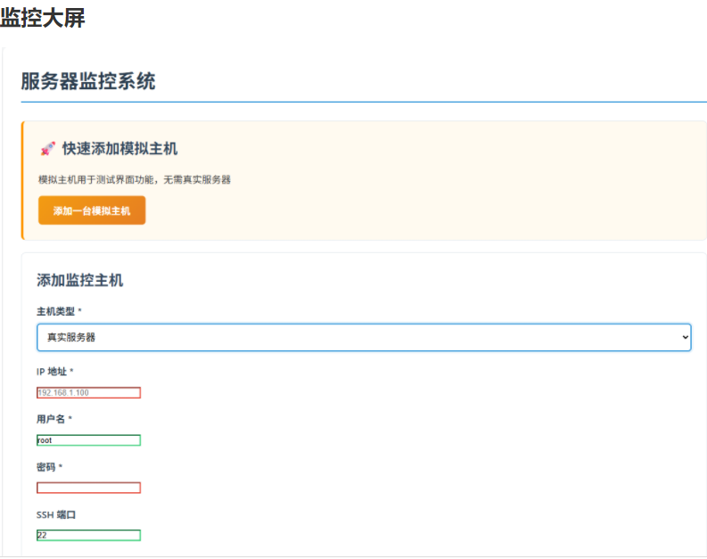
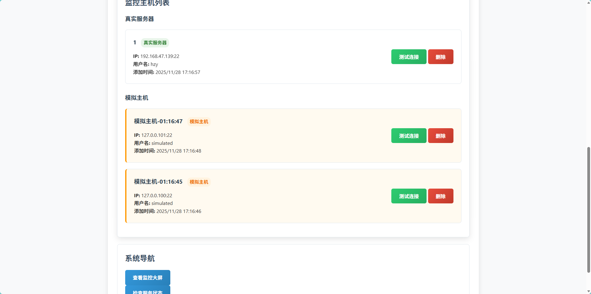
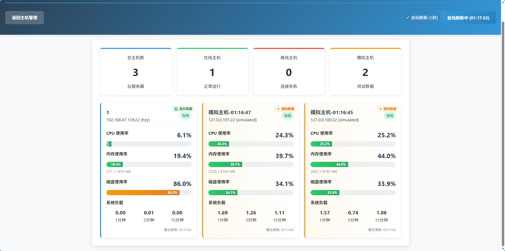

# 服务器实时监控数据大屏系统


一个功能强大的服务器实时监控系统，支持真实服务器SSH监控和模拟数据测试，提供直观的数据大屏展示。

## 📑 目录

- 系统简介
- 核心特性
- 界面预览
- 快速开始
- 使用指南
- 监控指标
- API接口
- 项目结构
- 技术栈
-  系统架构
- 故障排除
- 未来规划

## 系统简介

这是一个基于 Python + Flask 开发的分布式服务器监控系统，支持对多台 Linux 服务器进行实时监控和管理。系统采用容器化部署，通过自动部署轻量级 Agent 实现高频数据采集，结合现代化的 Web 界面，提供直观的监控大屏和详细的数据分析功能。

## ✨ 核心特性

- ### 🎯 主要功能

  #### 1. 实时监控指标

  - ✅ CPU使用率 - 实时更新
  - ✅ 内存使用率 - 总量/已用/使用率三维度监控
  - ✅ 系统负载 - 1分钟、5分钟、15分钟平均负载

  #### 2. 监控大屏

  - 📺 1920x1080固定比例设计 - 自动缩放适配各种屏幕
  - 🔄 0.5秒实时刷新 - 真正的实时数据更新
  - 📊 多维度可视化顶部概览卡片（在线主机数、平均资源使用率、总网速、告警数量）左侧主机列表（IP地址升序排列，实时状态展示）中间仪表盘（选中主机的CPU/内存/磁盘仪表盘）趋势图表（1小时历史数据曲线）网络流量图（实时网速波动图）告警信息流（活跃告警+主机状态变更，时间倒序）

  #### 3. 主机管理

  - ➕ 一键添加主机 - 输入IP、用户名、密码即可
  - 🤖 自动部署Agent - 无需手动操作，系统自动通过SSH部署
  - ⚙️ 灵活阈值配置 - 支持全局默认阈值和单机自定义阈值
  - 📝 主机备注 - 为每台主机添加描述信息
  - 🔍 详细信息查看 - 查看主机的实时指标和历史趋势


## 📸 界面预览

### 主机管理




### 监控大屏



## 🚀 快速开始

### 环境要求

- Docker 20.10+
- Docker Compose 2.0+
- 至少 2GB 可用内存
- 支持的操作系统：Linux, macOS, Windows

### 一键部署

```
# 克隆项目
git clone <项目地址>
cd server-monitor-dashboard1

# 运行部署脚本
chmod +x scripts/deploy.sh
./scripts/deploy.sh deploy
```

部署完成后访问：

- 主界面：http://localhost:5000
- 监控大屏：http://localhost:5000/dashboard
- 健康检查：http://localhost:5000/health

### 手动部署

```
# 构建镜像
docker-compose -f docker/docker-compose.yml build

# 启动服务
docker-compose -f docker/docker-compose.yml up -d
```


## 📖 使用指南

### 添加真实服务器

1. 访问主界面（http://localhost:5000）
2. 选择"真实服务器"类型
3. 填写服务器信息：IP地址：服务器公网/内网IP用户名：SSH登录用户名（如root）密码：SSH登录密码端口：SSH端口（默认22）
4. 点击"添加主机"
5. 使用"测试连接"验证服务器连通性

### 添加模拟主机

1. 点击"快速添加模拟主机"面板中的按钮
2. 输入模拟主机名称
3. 系统自动生成模拟数据，立即可用

### 查看监控数据

1. 访问监控大屏（http://localhost:5000/dashboard）
2. 系统自动显示所有已添加主机的实时数据
3. 数据每5秒自动刷新，支持手动刷新


## 📊 监控指标

### 基础指标

- **CPU使用率**：实时CPU负载百分比
- **内存使用率**：内存使用量和总量
- **磁盘使用率**：根分区磁盘使用情况
- **系统负载**：1分钟、5分钟、15分钟平均负载

### 数据标识

- 🟢 **真实数据**：通过SSH从真实服务器采集
- 🟠 **模拟数据**：系统生成的测试数据
- 🔴 **离线状态**：服务器连接失败


## 🔧 API接口

### 主机管理

- `GET /api/hosts`- 获取所有主机列表
- `POST /api/hosts`- 添加新主机
- `DELETE /api/hosts/<id>`- 删除主机
- `POST /api/test-connection/<id>`- 测试主机连接

### 数据采集

- `GET /api/metrics`- 获取实时监控数据
- `POST /api/collect-now/<id>`- 立即采集主机数据
- `POST /api/add-simulated-host`- 添加模拟主机

### 系统状态

- `GET /health`- 服务健康检查
- `GET /`- 主界面
- `GET /dashboard`- 监控大屏


## 📁 项目结构

```
server-monitor/
├── backend/                 # 后端代码
│   ├── app.py              # Flask主应用
│   └── requirements.txt    # Python依赖
├── frontend/               # 前端代码
│   ├── index.html          # 主机管理页面
│   ├── dashboard.html      # 监控大屏页面
│   ├── css/
│   │   └── style.css       # 样式文件
│   └── js/
│       ├── main.js         # 主机管理逻辑
│       └── dashboard.js    # 监控大屏逻辑
├── docker/                 # Docker配置
│   └── docker-compose.yml  # 容器编排
├── scripts/                # 部署脚本
│   └── deploy.sh           # 一键部署脚本
├── data/                   # 数据存储（自动创建）
└── logs/                   # 日志文件（自动创建）
```


## 🛠 技术栈

### 后端技术

- **Flask** - Python Web框架
- **Paramiko** - SSH协议库

### 前端技术

- **HTML5/CSS3** - 页面结构和样式
- **JavaScript ES6+** - 交互逻辑
- **响应式设计** - 移动端适配

### 部署运维

- **Docker** - 容器化部署
- **Docker Compose** - 服务编排
- **Shell脚本** - 自动化部署


## 🔄 系统架构

```
┌─────────────────┐    ┌──────────────────┐
│   前端界面       │    │   数据采集器      │
│  - 主机管理     │◄──►│  - SSH采集       │
│  - 监控大屏     │    │  - 模拟数据      │
└─────────────────┘    └──────────────────┘
         │                       │
         │                       │
         ▼                       ▼
┌─────────────────┐    ┌──────────────────┐
│   Flask API     │◄──►│   数据库         │
│  - RESTful接口  │    │  - 主机配置      │
│  - 实时数据推送 │    │  - 监控历史      │
└─────────────────┘    └──────────────────┘
```


## ⚙️ 配置说明

### 环境变量

```
# Flask配置
SECRET_KEY=your-secret-key
DEBUG=False

# 数据库配置
DATABASE_PATH=/app/data/monitor.db

# 服务端口
PORT=5000
```

### 调度配置

- **数据采集间隔**：30秒
- **实时数据刷新**：5秒
- **连接超时**：10秒
- **SSH超时**：15秒

##  

## 故障排除

### 常见问题

**Q: 服务器连接测试失败**

A: 检查网络连通性、SSH服务状态、用户名密码是否正确

**Q: 监控数据不更新**

A: 检查后端服务是否正常运行，查看日志文件

**Q: 页面无法访问**

A: 确认Docker容器是否启动，端口5000是否被占用

**Q: 模拟主机数据异常**

A: 这是正常现象，模拟数据会随机波动

### 查看日志

```
# 查看服务日志
docker-compose -f docker/docker-compose.yml logs

# 实时查看日志
docker-compose -f docker/docker-compose.yml logs -f
```

### 服务管理

```
# 停止服务
./scripts/deploy.sh stop

# 重启服务
./scripts/deploy.sh restart

# 查看状态
./scripts/deploy.sh status
```

## 🔮 未来规划

- 邮件/短信告警功能

- 历史数据图表分析

- 多用户权限管理

- 监控模板自定义

- 移动端APP支持

  数据导出功能


